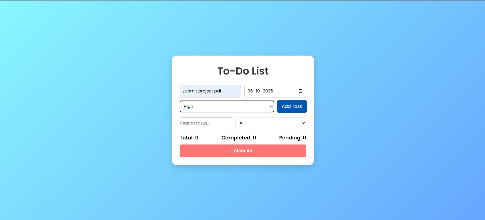
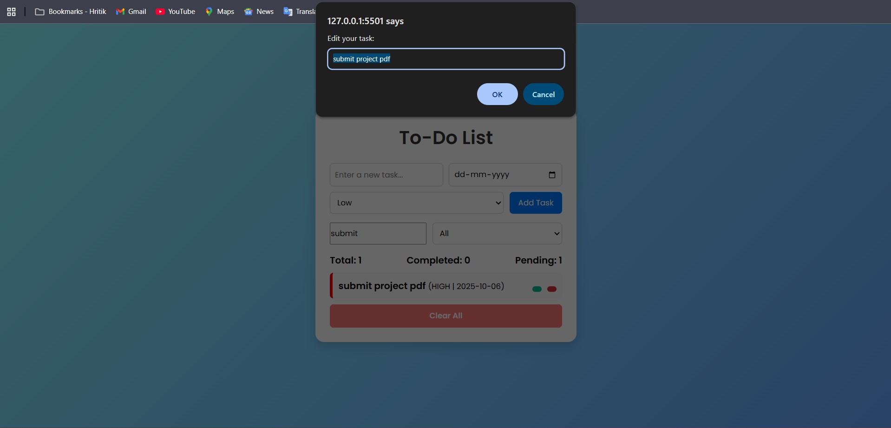
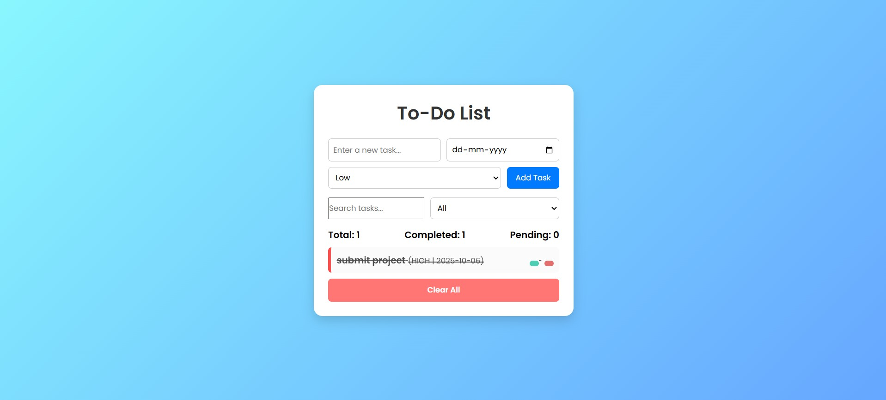
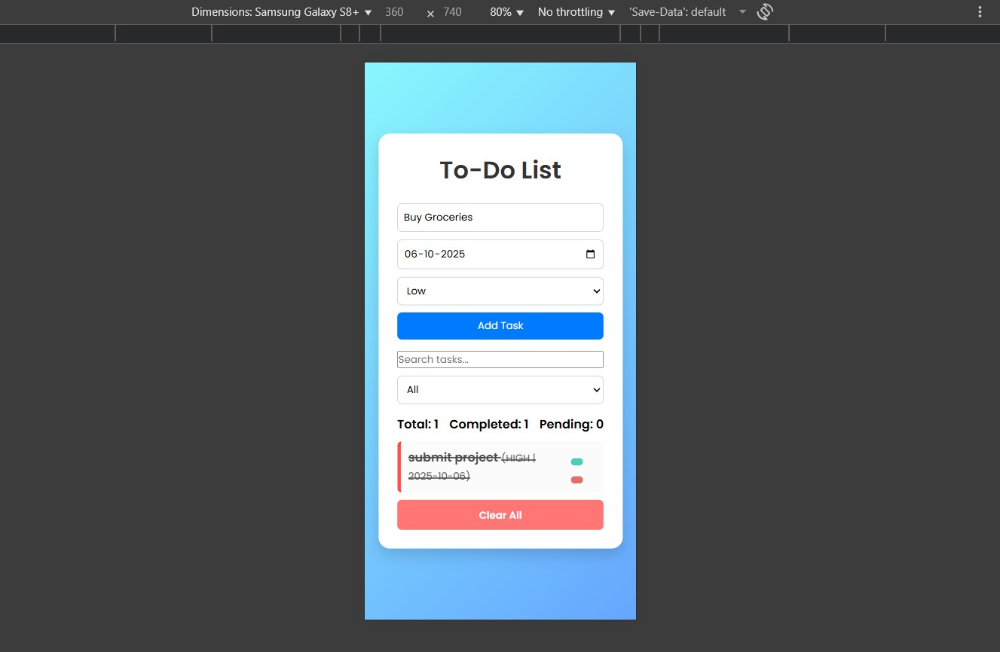

# ✅ To-Do List Web App

## 📘 Project Overview
The **To-Do List App** is a responsive and interactive web-based task management tool built using **HTML, CSS, and JavaScript**.  
It allows users to easily add, edit, delete, and mark tasks as completed.  
The app also stores tasks in the **browser’s localStorage**, so data persists even after refreshing or reopening the page.

This project was developed as part of my **Web Development Internship** under **Unified Mentor** to practice front-end development and UI design skills.

---

## 🎯 Objectives
- To create a user-friendly task manager using HTML, CSS, and JavaScript.  
- To implement **CRUD operations** (Create, Read, Update, Delete).  
- To store data persistently using **Local Storage**.  
- To ensure the application is **responsive** across devices.  
- To improve front-end coding structure and design.

---

## ⚙️ Technologies Used
| Technology | Purpose |
|-------------|----------|
| **HTML5** | Structure of the web app |
| **CSS3** | Styling and responsive design |
| **JavaScript (ES6)** | Functionality and logic |
| **Local Storage** | Data persistence |
| **Font Awesome** | Icons for UI |
| **Google Fonts (Poppins)** | Typography |

---

## 🧠 Features
✅ Add, Edit, Delete Tasks  
✅ Mark Tasks as Completed / Incomplete  
✅ Task Priority (High, Medium, Low)  
✅ Due Date Selection  
✅ Search & Filter Options  
✅ Task Counters (Total, Completed, Pending)  
✅ Responsive Design (Mobile-Friendly)  
✅ Data Saved in Browser Local Storage  
✅ Clean and Modern User Interface  

---

## 📱 Responsive Design
The app adapts to all screen sizes using CSS media queries.  
- **Desktop View:** 2-column input layout  
- **Mobile View:** stacked layout for easy input  

---

## Example Scenario

Let’s say you add these tasks:

“Complete README file” → Due: 2025-10-07 → Priority: High
“Design PPT slides” → Due: 2025-10-09 → Priority: Medium
“Email mentor for feedback” → Due: 2025-10-10 → Priority: Low

Your app will show them like this (each with color side indicators):

🔴 High = red border
🟠 Medium = orange
🟢 Low = green

You can now filter to see only pending, completed, or all tasks, and the counter will update automatically.

## 🖼️ Screenshots

1. Home Page 
   

2. Adding a Task 
   , (./screenshots/add_task-2.jpg) 

3. Editing a Task 
   ,
   (./screenshots/edit_task-1.jpg)

4. Completed Task View 
    

5. Mobile View  
   

---

## 🧩 How to Run the Project
1. Download the project ZIP or clone the repository.  
2. Extract the folder and open it in **VS Code**.  
3. Open the `index.html` file in your browser (or use Live Server extension).  
4. Start adding tasks, marking them as complete, and editing them!  

---

## 📂 Folder Structure
